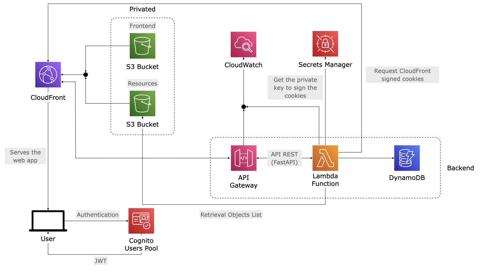

# AWS infrastructure for private resource hub

## Implemented infrastructure

Serverless private content platform on AWS with authentication (Cognito User Pool), API Gateway HTTP API with Lambda backend, DynamoDB single-table design for resource metadata and access control, and CloudFront distributions for secure frontend and private content delivery.

### Terraform modules

| Module | Main Resource | Purpose |
| :--- | :--- | :--- |
| `auth_cognito` | Cognito User Pool | User authentication and JWT token generation |
| `backend_api` | API Gateway HTTP API + Lambda | RESTful API endpoint with authorization |
| `backend_iam` | IAM Role | Lambda execution permissions (Logs, DynamoDB, Secrets Manager, S3) |
| `data_dynamodb` | DynamoDB Table | Single-table design for resource metadata and access records |
| `frontend_delivery` | S3 Bucket + CloudFront Distribution | Public SPA/static site delivery |
| `private_content_delivery` | S3 Bucket + CloudFront Distribution | Private content delivery with signed URLs/cookies |

### Architecture diagram

## Execution flow

End-to-end flow across frontend and backend applications:

1. **User Authentication**: User opens the frontend application ([private-resources-hub-frontend](https://github.com/acanza/private-resources-hub-frontend/)) and authenticates through AWS Cognito User Pool using OAuth2 Authorization Code flow with PKCE.

2. **Token Generation**: Cognito issues a JWT token that the frontend stores for subsequent API requests.

3. **Resource Discovery**: Frontend calls the backend API (`POST /resources/`) with the user's JWT bearer token and email. The backend ([private-resurces-hub-api](https://github.com/acanza/private-resurces-hub-api/)) validates the JWT against Cognito.

4. **Access Control Check**: Backend checks DynamoDB for the user's access permissions against each resource category, returning a list of accessible resources with metadata.

5. **Signed URL Generation**: For each resource the user has access to, the backend generates CloudFront signed URLs (valid for a limited time) using the RSA private key stored in AWS Secrets Manager.

6. **Content Display**: Frontend displays the list of accessible resources and allows the user to navigate categories using the signed URLs.

7. **Category Access Request**: When accessing a specific category, frontend calls `POST /resources/{category_id}/access`. Backend validates permissions and generates CloudFront signed cookies, returning them in response headers.

8. **Secure Content Delivery**: Browser automatically includes the signed cookies in requests to CloudFront. CloudFront validates the signatures and serves content from the private S3 bucket only if signatures are valid and not expired.

9. **Session Management**: Signed URLs and cookies have configurable TTLs. Once expired, users must re-request access through the API, ensuring continuous authorization checks.
